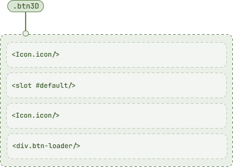

# Btn3D <Badge type="tip"><pre>.btn3D</pre></Badge>

> Button with 3D effect

<script setup>
    import { Btn3D } from '@8ctavio/vergil/components'
</script>

## Basic Usage

```vue
<script setup>
    import { Btn3D } from '@8ctavio/vergil/components'
</script>

<template>
    <Btn3D>Keep it Clean!</Btn3D>
</template>
```
<Demo>
    <Btn3D>Keep it Clean!</Btn3D>
</Demo>

## Props

### Label <Badge type="tip"><pre>label: string = ''</pre></Badge>

Simple `Btn3D` text content can be specified through the default slot or the `label` prop. The slot content overrides the `label` prop.

```vue
<Btn3D label="Click"/>
```

### Variant <Badge type="tip"><pre>variant: ('solid' | 'soft' | 'outline') = 'solid'</pre></Badge>

<Demo>
    <Btn3D variant="solid" label="Solid"/>
    <Btn3D variant="soft" label="Soft"/>
    <Btn3D variant="outline" label="Outline"/>
</Demo>

### Borderless <Badge type="tip"><pre>borderless: boolean</pre></Badge> <Badge type="warning">only for <pre>variant = "outline"</pre></Badge>

```vue
<Btn3D variant="outline" borderless label="Borderless"/>
```
<Demo>
    <Btn3D variant="outline" borderless label="Borderless"/>
</Demo>

### Theme <Badge type="tip"><pre>theme: ('brand' | 'ok' | 'info' | 'warn' | 'danger' | 'neutral') = 'brand'</pre></Badge>

There are aliases available for some `theme` prop values:

| Value      | Aliases |
| ---------- | ------- |
| `'ok'`     | `'success', 'check'` |
| `'info'`   | `'help', 'tip'` |
| `'warn'`   | `'warning', 'caution'` |
| `'danger'` | `'error'` |

<Demo>
    <div class="col">
        <div class="row center">
            <Btn3D variant="solid" theme="brand" label="Brand"/>
            <Btn3D variant="solid" theme="ok" label="Ok"/>
            <Btn3D variant="solid" theme="info" label="Info"/>
            <Btn3D variant="solid" theme="warn" label="Warn"/>
            <Btn3D variant="solid" theme="danger" label="Danger"/>
            <Btn3D variant="solid" theme="neutral" label="Neutral"/>
        </div>
        <div class="row center">
            <Btn3D variant="soft" theme="brand" label="Brand"/>
            <Btn3D variant="soft" theme="ok" label="Ok"/>
            <Btn3D variant="soft" theme="info" label="Info"/>
            <Btn3D variant="soft" theme="warn" label="Warn"/>
            <Btn3D variant="soft" theme="danger" label="Danger"/>
            <Btn3D variant="soft" theme="neutral" label="Neutral"/>
        </div>
        <div class="row center">
            <Btn3D variant="outline" theme="brand" label="Brand"/>
            <Btn3D variant="outline" theme="ok" label="Ok"/>
            <Btn3D variant="outline" theme="info" label="Info"/>
            <Btn3D variant="outline" theme="warn" label="Warn"/>
            <Btn3D variant="outline" theme="danger" label="Danger"/>
            <Btn3D variant="outline" theme="neutral" label="Neutral"/>
        </div>
    </div>
</Demo>

### Size <Badge type="tip"><pre>size: ('sm' | 'md' | 'lg' | 'xl') = 'md'</pre></Badge>

Changing the size mainly changes the font-size and adjusts padding accordingly.

<Demo>
    <Btn3D size="sm" label="Small"/>
    <Btn3D size="md" label="Medium"/>
    <Btn3D size="lg" label="Large"/>
    <Btn3D size="xl" label="Extra Large"/>
</Demo>

### Radius <Badge type="tip"><pre>radius: ('none' | 'sm' | 'md' | 'lg' | 'full') = 'md'</pre></Badge>

<Demo>
    <div class="col center">
        <div class="row center">
            <Btn3D label="Radius" size="sm" radius="none"/>
            <Btn3D label="Radius" size="md" radius="none"/>
            <Btn3D label="Radius" size="lg" radius="none"/>
            <Btn3D label="Radius" size="xl" radius="none"/>
        </div>
        <div class="row center">
            <Btn3D label="Radius" size="sm" radius="sm"/>
            <Btn3D label="Radius" size="md" radius="sm"/>
            <Btn3D label="Radius" size="lg" radius="sm"/>
            <Btn3D label="Radius" size="xl" radius="sm"/>
        </div>
        <div class="row center">
            <Btn3D label="Radius" size="sm" radius="md"/>
            <Btn3D label="Radius" size="md" radius="md"/>
            <Btn3D label="Radius" size="lg" radius="md"/>
            <Btn3D label="Radius" size="xl" radius="md"/>
        </div>
        <div class="row center">
            <Btn3D label="Radius" size="sm" radius="lg"/>
            <Btn3D label="Radius" size="md" radius="lg"/>
            <Btn3D label="Radius" size="lg" radius="lg"/>
            <Btn3D label="Radius" size="xl" radius="lg"/>
        </div>
        <div class="row center">
            <Btn3D label="Radius" size="sm" radius="full"/>
            <Btn3D label="Radius" size="md" radius="full"/>
            <Btn3D label="Radius" size="lg" radius="full"/>
            <Btn3D label="Radius" size="xl" radius="full"/>
        </div>
    </div>
</Demo>

### Spacing <Badge type="tip"><pre>spacing: ('compact' | 'expanded') = ''</pre></Badge>

Spacing refers to a `Btn3D`'s default padding and gap (for a given size). Changing spacing gives either a more compact or spacious look.

<Demo>
    <div class="col center">
        <div class="row center">
            <Btn3D size="sm" spacing="compact" label="Compact"/>
            <Btn3D size="sm" label="Default"/>
            <Btn3D size="sm" spacing="expanded" label="Expanded"/>
        </div>
        <div class="row center">
            <Btn3D size="md" spacing="compact" label="Compact"/>
            <Btn3D size="md" label="Default"/>
            <Btn3D size="md" spacing="expanded" label="Expanded"/>
        </div>
        <div class="row center">
            <Btn3D size="lg" spacing="compact" label="Compact"/>
            <Btn3D size="lg" label="Default"/>
            <Btn3D size="lg" spacing="expanded" label="Expanded"/>
        </div>
        <div class="row center">
            <Btn3D size="xl" spacing="compact" label="Compact"/>
            <Btn3D size="xl" label="Default"/>
            <Btn3D size="xl" spacing="expanded" label="Expanded"/>
        </div>
    </div>
</Demo>

### Squared <Badge type="tip"><pre>squared: boolean</pre></Badge>

Adding `squared` sets padding to the same value on all sides.

<Demo>
    <Btn3D size="sm" squared label="Small"/>
    <Btn3D size="md" squared label="Medium"/>
    <Btn3D size="lg" squared label="Large"/>
    <Btn3D size="xl" squared label="Extra Large"/>
</Demo>

### Disabled <Badge type="tip"><pre>disabled: boolean</pre></Badge>

<Demo>
    <Btn3D disabled label="Disabled" variant="solid"/>
    <Btn3D disabled label="Disabled" variant="soft"/>
    <Btn3D disabled label="Disabled" variant="outline"/>
</Demo>

### Loading <Badge type="tip"><pre>loading: boolean</pre></Badge>

<Demo>
    <Btn3D label="Loading" loading variant="solid"/>
    <Btn3D label="Loading" loading variant="soft"/>
    <Btn3D label="Loading" loading variant="outline"/>
</Demo>

<Demo>
    <div class="row center">
        <Btn3D label="Loading" loading theme="ok" variant="solid"/>
        <Btn3D label="Loading" loading theme="ok" variant="soft"/>
        <Btn3D label="Loading" loading theme="ok" variant="outline"/>
    </div>
    <div class="row center">
        <Btn3D label="Loading" loading theme="info" variant="solid"/>
        <Btn3D label="Loading" loading theme="info" variant="soft"/>
        <Btn3D label="Loading" loading theme="info" variant="outline"/>
    </div>
    <div class="row center">
        <Btn3D label="Loading" loading theme="warn" variant="solid"/>
        <Btn3D label="Loading" loading theme="warn" variant="soft"/>
        <Btn3D label="Loading" loading theme="warn" variant="outline"/>
    </div>
    <div class="row center">
        <Btn3D label="Loading" loading theme="danger" variant="solid"/>
        <Btn3D label="Loading" loading theme="danger" variant="soft"/>
        <Btn3D label="Loading" loading theme="danger" variant="outline"/>
    </div>
    <div class="row center">
        <Btn3D label="Loading" loading theme="neutral" variant="solid"/>
        <Btn3D label="Loading" loading theme="neutral" variant="soft"/>
        <Btn3D label="Loading" loading theme="neutral" variant="outline"/>
    </div>
</Demo>

<Demo>
    <div class="col center">
        <div class="row center">
            <Btn3D label="Loading" loading size="sm" spacing="compact"/>
            <Btn3D label="Loading" loading size="sm"/>
            <Btn3D label="Loading" loading size="sm" spacing="expanded"/>
        </div>
        <div class="row center">
            <Btn3D label="Loading" loading size="md" spacing="compact"/>
            <Btn3D label="Loading" loading size="md"/>
            <Btn3D label="Loading" loading size="md" spacing="expanded"/>
        </div>
        <div class="row center">
            <Btn3D label="Loading" loading size="lg" spacing="compact"/>
            <Btn3D label="Loading" loading size="lg"/>
            <Btn3D label="Loading" loading size="lg" spacing="expanded"/>
        </div>
        <div class="row center">
            <Btn3D label="Loading" loading size="xl" spacing="compact"/>
            <Btn3D label="Loading" loading size="xl"/>
            <Btn3D label="Loading" loading size="xl" spacing="expanded"/>
        </div>
    </div>
</Demo>

### Icon <Badge type="tip"><pre>icon: string</pre></Badge> <Badge type="info">alias: <pre>icon-left</pre></Badge>

```vue
<Btn3D label="Rocket" icon="rocket_launch"/>
```

<Demo>
    <div class="row center">
        <Btn3D icon="rocket_launch" label="Rocket" theme="brand" variant="solid"/>
        <Btn3D icon="rocket_launch" label="Rocket" theme="brand" variant="soft"/>
        <Btn3D icon="rocket_launch" label="Rocket" theme="brand" variant="outline"/>
    </div>
    <div class="row center">
        <Btn3D icon="rocket_launch" label="Rocket" theme="ok" variant="solid"/>
        <Btn3D icon="rocket_launch" label="Rocket" theme="ok" variant="soft"/>
        <Btn3D icon="rocket_launch" label="Rocket" theme="ok" variant="outline"/>
    </div>
    <div class="row center">
        <Btn3D icon="rocket_launch" label="Rocket" theme="info" variant="solid"/>
        <Btn3D icon="rocket_launch" label="Rocket" theme="info" variant="soft"/>
        <Btn3D icon="rocket_launch" label="Rocket" theme="info" variant="outline"/>
    </div>
    <div class="row center">
        <Btn3D icon="rocket_launch" label="Rocket" theme="warn" variant="solid"/>
        <Btn3D icon="rocket_launch" label="Rocket" theme="warn" variant="soft"/>
        <Btn3D icon="rocket_launch" label="Rocket" theme="warn" variant="outline"/>
    </div>
    <div class="row center">
        <Btn3D icon="rocket_launch" label="Rocket" theme="danger" variant="solid"/>
        <Btn3D icon="rocket_launch" label="Rocket" theme="danger" variant="soft"/>
        <Btn3D icon="rocket_launch" label="Rocket" theme="danger" variant="outline"/>
    </div>
    <div class="row center">
        <Btn3D icon="rocket_launch" label="Rocket" theme="neutral" variant="solid"/>
        <Btn3D icon="rocket_launch" label="Rocket" theme="neutral" variant="soft"/>
        <Btn3D icon="rocket_launch" label="Rocket" theme="neutral" variant="outline"/>
    </div>
</Demo>

### Icon Right <Badge type="tip"><pre>icon-right: string</pre></Badge>

```vue
<Btn3D label="Omega" icon-right="special_character"/>
```

<Demo>
    <Btn3D label="Omega" icon-right="special_character" variant="solid"/>
    <Btn3D label="Omega" icon-right="special_character" variant="soft"/>
    <Btn3D label="Omega" icon-right="special_character" variant="outline"/>
</Demo>

<Demo>
    <div class="col center">
        <div class="row center">
            <Btn3D label="Omega" icon-right="special_character" size="sm" spacing="compact"/>
            <Btn3D label="Omega" icon-right="special_character" size="sm"/>
            <Btn3D label="Omega" icon-right="special_character" size="sm" spacing="expanded"/>
        </div>
        <div class="row center">
            <Btn3D label="Omega" icon-right="special_character" size="md" spacing="compact"/>
            <Btn3D label="Omega" icon-right="special_character" size="md"/>
            <Btn3D label="Omega" icon-right="special_character" size="md" spacing="expanded"/>
        </div>
        <div class="row center">
            <Btn3D label="Omega" icon-right="special_character" size="lg" spacing="compact"/>
            <Btn3D label="Omega" icon-right="special_character" size="lg"/>
            <Btn3D label="Omega" icon-right="special_character" size="lg" spacing="expanded"/>
        </div>
        <div class="row center">
            <Btn3D label="Omega" icon-right="special_character" size="xl" spacing="compact"/>
            <Btn3D label="Omega" icon-right="special_character" size="xl"/>
            <Btn3D label="Omega" icon-right="special_character" size="xl" spacing="expanded"/>
        </div>
    </div>
</Demo>

## Styling

### Anatomy



## API Reference

| prop | type | default |
| ---- | ---- | ------- |
| `label` | `string` | `''` |
| `variant` | `'solid' \| 'soft' \| 'outline'` | `'solid'` |
| `borderless` | `boolean` | `false` |
| `theme` | `'brand' \| 'ok' \| 'info' \| 'warn' \| 'danger' \| 'neutral'` | `'brand'` |
| `size` | `'sm' \| 'md' \| 'lg' \| 'xl'` | `'md'` |
| `radius` | `'none' \| 'sm' \| 'md' \| 'lg' \| 'full'` | `'md'` |
| `spacing` | `'' \| 'compact' \| 'extended'` | `''` |
| `squared` | `boolean` | `false` |
| `disabled` | `boolean` | `false` |
| `loading` | `boolean` | `false` |
| `icon` | `string` | `''` |
| `icon-left` | `string` | `''` |
| `icon-right` | `string` | `''` |